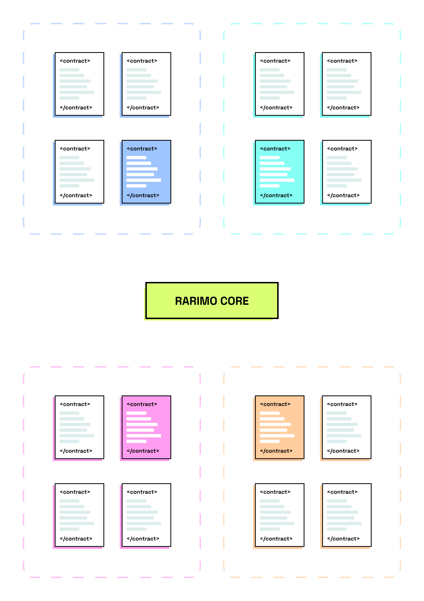

---
---

# Rarimo architecture and operating principles

## Design principles

### Security and cost efficiency

Rarimo is built with the transfer cost of a centralized messaging solution and the security of multisignature ones. By
using a threshold signature mechanism for creating proofs for asset unlocking, it can offer a greater number of
validators without a loss of speed and keep gas costs low.

### Scalability

The Rarimo core has no limit on the number of blockchains connected to it. Systems can be added through voting by
protocol users. There is a global pool designed for paying out for bringing the data from networks. Rewards for a
particular oracle (signer) are calculated depending on the number of networks they support.

### Simplicity

The messaging service is designed to maximize smart-contract efficiency; users can complete asset migration or send
messages over multiple networks with a minimum number of actions. The entire flow can be described in two phases:

1. Sending a message or event to the Rarimo Contract on the initial network
2. Claiming the appropriate proof of the action from the Rarimo core and transferring it to the destination network

From the identity perspective, users can use their claims on any network on demand. They shouldn’t pay for migrating the
particular artifact to all connected networks - protocol efficiently propagates states, and user claims their artifacts
where and when they need.

Accordingly, this approach:

- Greatly simplifies the development of end applications that operate on Rarimo
- Reduces the requirements for the device due to the possibility of using a light client
- More cost-efficient, as it reduces gas consumption compared to solutions that use a lot of non-atomic calls

### Decentralization

The system is based on a network of independent validators supporting the Rarimo core and oracles responsible for
delivering messages over the network (both roles make sense and can be performed by the same network participant).

## Infrastructure components and their orchestration

The messaging infrastructure consists of the following components:

- Rarimo Core
- Rarimo Contracts
- dApps Contracts

### Rarimo core

The Rarimo Core is a decentralized blockchain-based system designated for timestamping events to be transferred through
the networks. The Rarimo Core is the source of information needed for the proper functioning of Rarimo Contracts. The
Rarimo core is maintained by a set of validators that achieve consensus using the BFT-based consensus algorithm. It
assumes that for consensus reaching (with fault tolerance), the max amount of faulty validators can be:

_N_fault = ⸤(N-1)/3⸥_

For the validator’s selection, Rarimo uses delegated Proof of Stake mechanism. Any user can propose themself as a
validator; if other users trust the delegate, they can stake their tokens for them to become a validator. The delegates
with the top staked balances are selected as validators.

As mentioned earlier, logically, the role of the validator is separated from the role of the oracle. But it is expected
that a lot of nodes will support both functionalities. Additionally, the network can be expanded with **existing Oracle
services.**

### Rarimo Contract

These contracts are deployed on the particular smart contract platform and are needed for:

1. Receiving events from the user in the source chain
2. Sending events after receiving proof-of-action, generated by the Rarimo core

### dApp Contract

The contract of the decentralized application with which users perform actions. Examples: ERC-20 and NFT contracts,
exchanges, applications for lending and borrowing, etc.

## Roles

_Initiator_ - the user that performs some action for transferring assets or messages over the networks.

_Receiver_ - the user or decentralized application that exists on the destination chain and should be updated due to
performed action.

_Prover_ - this role that anyone can act. This role aims to provide proof generated by the Rarimo core for initiating
events in the destination chain. Usually, this role is played by oracles.

_Validator_ - the maintainer of the protocol infrastructure. It reaches a consensus with other validators according to
the acceptance of new blocks and transactions. Also, validators must listen to all connected networks for receiving
events bound with tokens locking.

_Signers (oracles)_ - the participant that can bring the data to/from Rarimo core and cosign this action with threshold
digital signature.

## Rarimo message format

Rarimo has its own message format, which maintains compatibility with formats of the most common assets (standards) on
existing blockchains as follows.

|                Field | Purpose                                                                                                               |
| -------------------: | --------------------------------------------------------------------------------------------------------------------- |
|                   ID | Message                                                                                                               |
|              Payload | The data that should be transferred to the destination contract                                                       |
|         Parent chain | Source chain identifier                                                                                               |
|        Action source | The address (identifier) of the contract or the user who initiated the message transfer                               |
|    Destination chain | Identifier of the destination chain                                                                                   |
| Destination contract | Identifies the address (identifier) of the contract or the user who will receive the message and update his own state |

## Updating the state of Rarimo core

For sending and confirming transactions **Rarimo** uses blockchain technology to keep a history of transactions
associated with the protocol These mechanisms are handy for recovering the full history and origin of the unique entity
that travels over the web3. The block structure in the blockchain can be represented as follows:

|                   Field | Purpose                                                                                                                                                                                                                                                                                                       |
| ----------------------: | ------------------------------------------------------------------------------------------------------------------------------------------------------------------------------------------------------------------------------------------------------------------------------------------------------------- |
|            Block header | The structure that includes all metadata needed for block validation.                                                                                                                                                                                                                                         |
| Data (transaction list) | The list of transactions that are confirmed in this block.                                                                                                                                                                                                                                                    |
|                Evidence | The threshold ECDSA and EdDSA signatures of the current validators’ quorum. For creating the correct signature signatures more than 2/3 of the quorum is required. Each signature has to cover the block header data. Threshold signatures are required to keep efficiency during the signature verification. |

And for the transparency of processes, consider the structure of the block header:

|     Field | Purpose                                                                                                   |
| --------: | --------------------------------------------------------------------------------------------------------- |
|   Version | The field consists of the current version of the protocol (according to which block has to be validated). |
|    Height | The sequence number of the block in the chain.                                                            |
| Timestamp | UNIX timestamp when a block was created.                                                                  |
|  PrevHash | The identifier (hash value) of the previous block in the blockchain.                                      |
|  DataHash | The Merkle Tree all transactions added to the current block.                                              |

So when some transaction should be added to the blockchain, the proposer (the validator that initially forms the block
and propagates it with all other validators) puts this transaction to the block (with other transactions), signs it, and
distributes it through the network. The validator that left their signature on the block confirms that all included
transactions are correct. After the round of consensus reaching is performed (all other validators agree to add the
transaction), the block is connected to the blockchain, and the state of the system (Rarimo core) is updated.
