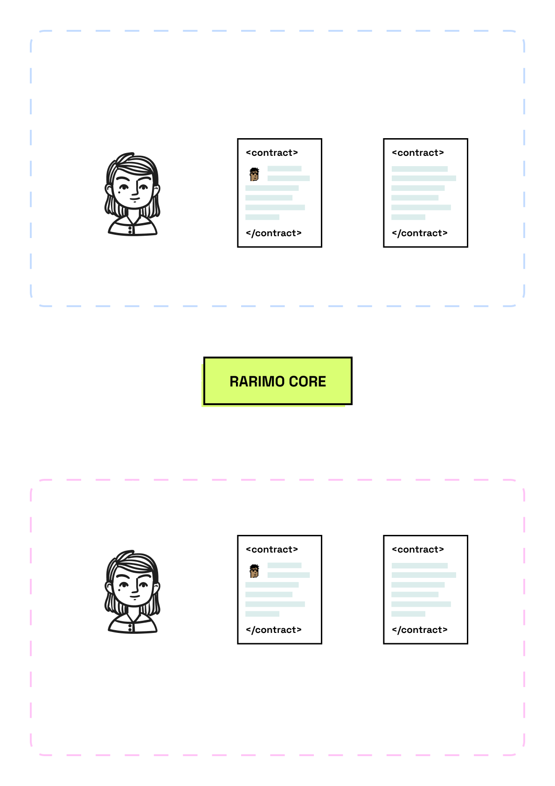
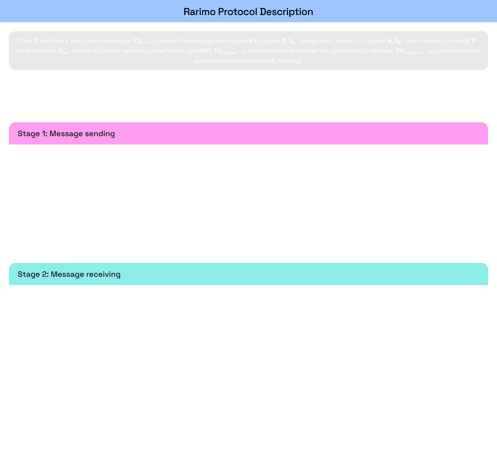

---
---

# Main flow of messages transferring
The main flow of message transfer happens in 4 steps:
1. Initiator creates action and sends it to the Rarimo Contract
  * There is an alternative case when Oracles track some specific events on defined contracts and react on them,
sending appropriate messages to the Rarimo core.
2. Validators add a transaction to the Rarimo core (by consensus reaching) and generate a time-stamped witness of its
existence.
3. Prover receives the witness from the Rarimo core and provides it to the Rarimo Contract on the destination chain.
  * As we mentioned earlier, the Prover can be the user themself or Oracles if their work is paid in this case.
4. Receiver updates their state depending on the received message.

Let’s see examples of how it works for real cases:

Cross-Chain Transfer:
1. To transfer a message from one system to another, Alice creates an event in the ***Rarimo contract***.
2. The oracles listen to the new events and submit them to the Rarimo Core
3. The block proposer adds this transaction to the block, signs it, and transfers it to other validators. If 2/3+
current validators have signed the block (if the threshold signature is valid), it’s added to the blockchain
irreversible.
4. The oracles vote for the events’ correctness
5. Successful voting will automatically initiate the creation of the witness needed by the message client
6. The Prover listens to events in the Rarimo core and in the case of needed block confirmation - receives the needed
witness. So, what is the witness? The witness is a data structure that includes:
  * Transaction with event
  * The header of the block in which the transaction was added
  * Evidence of the block in which the transaction was added
  * Merkle branch for proving that the transaction is included in the needed block.
7. The Prover provides the witness to the Rarimo Contract, and the contract performs the following verification:
a. That this witness wasn’t confirmed before (contract stores hash values of all previous witnesses)
b. The signature of the block header (using evidence)
c. The Merkle branch for confirming that the transaction is included in the needed block
________________________________________________________________________________________________________________________
Multichain Identity Usage

1. The identity provider issues a verifiable credential (claim) to Alice on the operational chain and updates the
identity state. The identity provider can add an arbitrary amount of other identities to the state without updating its
cross-chain after each new identity (it allows reduced costs, at the same time, state transitions allow to verify the
correctness of the new state).
2. If Alice requires her identity on the external chain urgently, she can call Rarimo Core and update the state herself.
Overwise, she can wait for when the Identity provider or Oracles will do that.
3. The block proposer adds this transaction (with updated state) to the block, signs it, and transfers it to other
validators. If 2/3+ current validators have signed the block (if the threshold signature is valid), it’s added to the
blockchain and is irreversible.
4. The oracles vote for the events’ correctness
5. Successful voting will automatically initiate the creation of the witness needed by the message client.
6. The Prover listens to events in the Rarimo core and in the case of needed block confirmation - receives the needed
witness. So, what is the witness? The witness is a data structure that includes:
  * Transaction with the event (new identity state)
  * The header of the block in which the transaction was added
  * Evidence of the block in which the transaction was added
  * Merkle branch for proving that the transaction is included in the needed block.
7. The Prover provides the witness to the Rarimo Contract, and the contract performs the following verification:
  * That this witness wasn’t confirmed before (contract stores hash values of all previous witnesses)
  * The signature of the block header (using evidence)
  * The Merkle branch for confirming that the transaction is included in the needed block
  * The state transition is correct
8. Then Alice can prove her claim ownership directly on the destination chain.

So we can see that besides we operate with different types of entities (token in the first case and VC in the second) -
the flow of how the Rarimo protocol works is pretty similar.

It’s very interesting how this concept satisfies digital identity requirements. As we mentioned at the start of this
whitepaper - identity artifacts can’t be limited only by VCs, or only by NFTs/SBTs, or only by reputation. The Rarimo
approach allows you to work with all mentioned using a similar flow, making integration easy and seamless.

