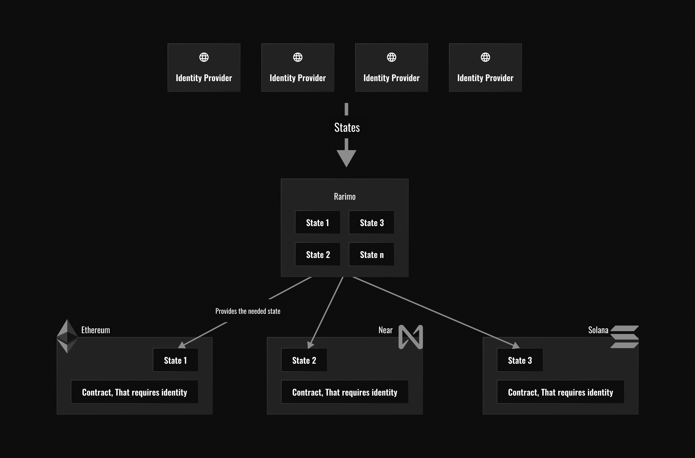

---
---

# Rarimo Identity sub-protocol
Rarimo allows the creation of a ZKP-based digital identity directly in the Rarimo Core with portability to connected
chains. Rarimo supports EVM-compatible smart contracts that allow contributors to build dApps using a cross-chain
messaging layer. One such dApp is the ZK identity protocol based on Iden3[10]. This protocol allows identity providers
to publish only state hash into the Rarimo blockchain. After its propagation to the connected networks - DApps can use
mentioned states to verify some identity statements. This means that the user doesn’t need to reveal sensitive
information on-chain or pay fees for multiple transactions for bridging identity events themselves.

This flow presumes the creation identity of the user by the identity provider and pushing its state in the Rarimo chain.
From time to time (or on demand), identity states are broadcasted over connected networks and available for usage by end
users directly on required chains. It means that sometimes (after the needed amount of states is ready for batching and
propagating them to the destination chains), Rarimo will do this reconciliation. But if the user or identity provider
wants to update their states urgently, it means they can initiate this update themself (but obviously with the higher
fee cost).

Rarimo’s cross-chain messaging and hub architecture allow the synchronization of these states between all connected
chains easily and with lower fees. This enables identities published on Rarimo to be used on any chain.

It opens a huge opportunity for all involved parties:
* **Users** can have portable identity VCs issued by the party they need
* **Identity** providers can compete for quality VCs they issued and create a marketplace for current web3 with
different identity verification models
* As an **identity consumer** (off-chain verifier or smart contract) developer can decide which identity provider to
select for integrating into a DApp (from the cost and compliance perspectives). Moreover, it makes propagating my
business logic over the chain easier.
* As an **aggregator of identity providers** - user has an opportunity to migrate the whole infrastructure to other
chains.